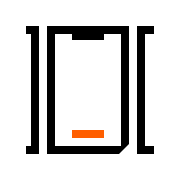

# iOS Templates

iOS templates commonly used in [Futured apps](https://futured.app).

#### MVVM-C templates
The main template generates a new scene using MVVM-C architecture used to used in [Futured apps](https://futured.app). For more specific navigation cases there are window, modal, show, push and tab bar scene templates. 

#### CellKit templates
Basic templates that make working with the [CellKit](https://github.com/futuredapp/CellKit) easier. A table view cell template with model and XIB is available. 

#### FTAPIKit templates
Basic templates that make working with the [FTAPIKit](https://github.com/futuredapp/FTAPIKit) easier. A API endpoint template is available.

#### SwiftUI templates
The template generates a new scene in SwiftUI. A scene consists of a View and a ViewState.

## Installation

The templates can be added to Xcode simply by cloning the repo and running `make` in it.

Also, they could be installed by running some template management tool like [xcman](https://github.com/josefdolezal/xcman):

```
xcman templates install --name Futured\ Templates futuredapp/iOS-templates
```

## Contributors

Current maintainer and main contributor is [Patrik Potoček](https://github.com/Patrez), <patrik.potocek@futured.app>.

We want to thank other contributors, namely:

- [Matěj Kašpar Jirásek](https://github.com/mkj-is)
- [Mikoláš Stuchlík](https://github.com/mikolasstuchlik)
- [Adam Leitgeb](https://github.com/adam-leitgeb)
- [Petr Zvoníček](https://github.com/zvonicek)
- [Michal Simik](https://github.com/michals92)
- [Tomáš Babulák](https://github.com/tomasbabulak)
- [Adam Bezak](https://github.com/michalsrutek)
- [Adam Salih](https://github.com/max9631)
- [Radek Doležal](https://github.com/eRDe33)

## License

`iOS Templates` are available under the MIT license. See the [LICENSE](LICENSE) for more information.
