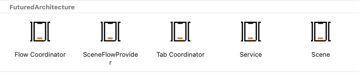

# iOS Templates

Common iOS templates used at [Futured](https://futured.app).

#### FTAPIKit templates
Simplifies working with [FTAPIKit](https://github.com/futuredapp/FTAPIKit). Includes an API endpoint template.

#### FuturedArchitecture templates
Generates files following the Futured iOS architecture defined in [FuturedKit](https://github.com/futuredapp/futuredkit).



#### KMP templates
Generates a new scene (View and ViewModel) for KMP projects.

## Installation

To add the templates to Xcode, clone the repo and run `make`:

```bash
git clone --depth=1 https://github.com/futuredapp/iOS-templates.git
cd iOS-templates
make
```

To install only specific template, run make inside its folder (FTAPIKit, FuturedArchitecture, or KMP):

```bash
git clone --depth=1 https://github.com/futuredapp/iOS-templates.git
cd iOS-templates/FuturedArchitecture
make
```

## License

`iOS Templates` are available under the MIT license. See the [LICENSE](LICENSE) for more information.
